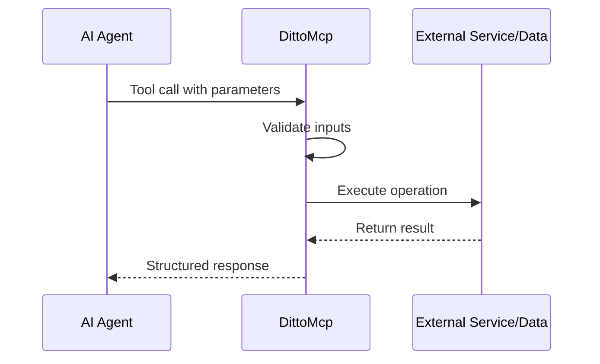

# DittoMcp

**IoT device management tools for AI agents**

---

## Overview

An MCP (Model Context Protocol) server that enables AI agents to perform specialized operations through a standardized interface.

**DittoMcp** provides 10 tools including `create_ditto_message`, `create_ditto_thing`, `parse_ditto_message`, `create_ditto_command`, `create_ditto_event`, and 5 more.

An MCP server providing 10 tools for various operations.

## Architecture

```mermaid
flowchart LR
    subgraph Agents["AI Agents"]
        A[Claude / GPT / LangChain]
    end

    subgraph Server["DittoMcp"]
        T0[create_ditto_message]
        T1[create_ditto_thing]
        T2[parse_ditto_message]
        T3[create_ditto_command]
        T4[create_ditto_event]
        T5[create_ditto_feature]
        T6[send_ditto_http_request]
        T7[create_ditto_policy]
    end

    subgraph Output["Results"]
        R[Structured Data / Actions]
    end

    Agents --> Server
    Server --> Output
```



## How It Works



## Tools Overview

| Tool | Description |
|------|-------------|
| `create_ditto_message` | Creates an Eclipse Ditto protocol message for sending com... |
| `create_ditto_thing` | Creates a complete Eclipse Ditto Thing definition with at... |
| `parse_ditto_message` | Parses an incoming Eclipse Ditto protocol message and ext... |
| `create_ditto_command` | Creates a Ditto protocol command message for modifying th... |
| `create_ditto_event` | Creates a Ditto protocol event message for notifying abou... |
| `create_ditto_feature` | Creates a Ditto feature definition with properties and de... |
| `send_ditto_http_request` | Sends an HTTP request to Eclipse Ditto REST API for thing... |
| `create_ditto_policy` | Creates an Eclipse Ditto policy for fine-grained access c... |
| `validate_ditto_message` | Validates an Eclipse Ditto protocol message against the p... |
| `subscribe_ditto_websocket` | Establishes a WebSocket connection to Eclipse Ditto for r... |

---

## Quick Start

```bash
# Install dependencies
pip install -e .

# Run the server
python server.py
```

## Installation

```bash
pip install -e .
```

## Usage

### With Claude Code / Claude Desktop

Add to your `.claude/mcp.json`:

```json
{
  "mcpServers": {
    "dittomcp": {
      "command": "python",
      "args": ["./server.py"]
    }
  }
}
```

### With OpenAI Agents SDK

```python
from agents import Agent
from agents.mcp import MCPServerStdio

async with MCPServerStdio(
    command="python",
    args=["./server.py"],
) as mcp_server:
    agent = Agent(
        name="DittoMcp",
        mcp_servers=[mcp_server]
    )
```

### With LangChain

```python
from langchain_mcp_adapters import load_mcp_tools

tools = await load_mcp_tools(
    command="python",
    args=["./server.py"]
)
agent = create_react_agent(llm, tools)
```

### With Docker

```bash
# Build
docker build -t dittomcp .

# Run
docker run dittomcp
```

---

## Tool Reference

### `create_ditto_message`

Creates an Eclipse Ditto protocol message for sending commands or events to IoT devices.

**Parameters:**

| Name | Type | Required | Description |
|------|------|----------|-------------|
| `topic` | string | Yes | The Ditto protocol topic in format: namespace/thing_id/things/twin/commands/action or similar |
| `path` | string | No | The path to the resource (e.g., /features/temperature/properties/value) |
| `value` | object | Yes | The payload value to send (can be any JSON-serializable object) |
| `headers` | object | No | Optional headers like correlation-id, response-required, etc. |

**Returns:**

- `topic` (string): The Ditto protocol topic
- `headers` (object): Message headers
- `path` (string): Resource path
- `value` (object): The payload
- `status` (integer): HTTP status code if applicable

**Example:**

```python
result = create_ditto_message(topic="example", path="example", value={...})
```

---

### `create_ditto_thing`

Creates a complete Eclipse Ditto Thing definition with attributes, features, and metadata.

**Parameters:**

| Name | Type | Required | Description |
|------|------|----------|-------------|
| `thing_id` | string | Yes | The unique identifier for the thing in format namespace:name |
| `attributes` | object | No | Key-value pairs of thing attributes (e.g., location, manufacturer) |
| `features` | object | No | Features of the thing with their properties (e.g., temperature sensor with value) |
| `policy_id` | string | No | Optional policy ID for access control |

**Returns:**

- `thingId` (string): The thing identifier
- `policyId` (string): Policy identifier
- `attributes` (object): Thing attributes
- `features` (object): Thing features

**Example:**

```python
result = create_ditto_thing(thing_id="example", attributes={...}, features={...})
```

---

### `parse_ditto_message`

Parses an incoming Eclipse Ditto protocol message and extracts its components.

**Parameters:**

| Name | Type | Required | Description |
|------|------|----------|-------------|
| `message` | string | Yes | The raw Ditto protocol message as JSON string or dict |

**Returns:**

- `topic` (string): Parsed topic
- `namespace` (string): Extracted namespace
- `thing_id` (string): Extracted thing ID
- `channel` (string): Channel (twin/live)
- `criterion` (string): Criterion (commands/events/messages)
- `action` (string): Action type
- `path` (string): Resource path
- `value` (object): Message payload
- `headers` (object): Message headers

**Example:**

```python
result = parse_ditto_message(message="example")
```

---

### `create_ditto_command`

Creates a Ditto protocol command message for modifying thing state (modify, create, delete, retrieve).

**Parameters:**

| Name | Type | Required | Description |
|------|------|----------|-------------|
| `thing_id` | string | Yes | The thing ID in format namespace:name |
| `command_type` | string | Yes | Command type: modify, create, delete, or retrieve |
| `channel` | string | No | Communication channel: twin or live |
| `path` | string | No | Path to resource (e.g., /attributes/location or /features/temp) |
| `value` | object | No | The value to set (not needed for retrieve/delete commands) |
| `correlation_id` | string | No | Optional correlation ID for request tracking |

**Returns:**

- `topic` (string): Formatted command topic
- `headers` (object): Command headers
- `path` (string): Resource path
- `value` (object): Command payload

**Example:**

```python
result = create_ditto_command(thing_id="example", command_type="example", channel="example")
```

---

### `create_ditto_event`

Creates a Ditto protocol event message for notifying about thing state changes.

**Parameters:**

| Name | Type | Required | Description |
|------|------|----------|-------------|
| `thing_id` | string | Yes | The thing ID in format namespace:name |
| `event_type` | string | Yes | Event type: created, modified, deleted |
| `channel` | string | No | Communication channel: twin or live |
| `path` | string | No | Path to changed resource |
| `value` | object | Yes | The changed value |
| `revision` | integer | No | Thing revision number |

**Returns:**

- `topic` (string): Formatted event topic
- `headers` (object): Event headers with revision
- `path` (string): Resource path
- `value` (object): Event payload

**Example:**

```python
result = create_ditto_event(thing_id="example", event_type="example", channel="example")
```

---

### `create_ditto_feature`

Creates a Ditto feature definition with properties and desired properties for IoT device capabilities.

**Parameters:**

| Name | Type | Required | Description |
|------|------|----------|-------------|
| `feature_id` | string | Yes | Unique identifier for the feature (e.g., temperature, humidity) |
| `properties` | object | No | Current property values of the feature |
| `desired_properties` | object | No | Desired property values for the feature |
| `definition` | array | No | Array of definition identifiers (e.g., ['org.example:TemperatureSensor:1.0.0']) |

**Returns:**

- `feature_id` (string): Feature identifier
- `definition` (array): Feature definition
- `properties` (object): Feature properties
- `desiredProperties` (object): Desired properties

**Example:**

```python
result = create_ditto_feature(feature_id="example", properties={...}, desired_properties={...})
```

---

### `send_ditto_http_request`

Sends an HTTP request to Eclipse Ditto REST API for thing management operations.

**Parameters:**

| Name | Type | Required | Description |
|------|------|----------|-------------|
| `base_url` | string | Yes | Base URL of Ditto API (e.g., http://localhost:8080/api/2) |
| `endpoint` | string | Yes | API endpoint path (e.g., /things/namespace:thing-1) |
| `method` | string | No | HTTP method: GET, POST, PUT, PATCH, DELETE |
| `auth` | object | No | Authentication credentials with username and password |
| `payload` | object | No | Request body payload |
| `headers` | object | No | Additional HTTP headers |

**Returns:**

- `status_code` (integer): HTTP status code
- `response` (object): Response body
- `headers` (object): Response headers
- `error` (string): Error message if request failed

**Example:**

```python
result = send_ditto_http_request(base_url="example", endpoint="example", method="example")
```

---

### `create_ditto_policy`

Creates an Eclipse Ditto policy for fine-grained access control on things and their resources.

**Parameters:**

| Name | Type | Required | Description |
|------|------|----------|-------------|
| `policy_id` | string | Yes | Unique policy identifier in format namespace:name |
| `entries` | object | Yes | Policy entries mapping labels to subjects and resources with permissions |

**Returns:**

- `policyId` (string): Policy identifier
- `entries` (object): Policy entries with subjects and resources

**Example:**

```python
result = create_ditto_policy(policy_id="example", entries={...})
```

---

### `validate_ditto_message`

Validates an Eclipse Ditto protocol message against the protocol specification.

**Parameters:**

| Name | Type | Required | Description |
|------|------|----------|-------------|
| `message` | object | Yes | The Ditto protocol message to validate |

**Returns:**

- `valid` (boolean): Whether the message is valid
- `errors` (array): List of validation errors if any
- `warnings` (array): List of validation warnings

**Example:**

```python
result = validate_ditto_message(message={...})
```

---

### `subscribe_ditto_websocket`

Establishes a WebSocket connection to Eclipse Ditto for real-time streaming of thing events and messages.

**Parameters:**

| Name | Type | Required | Description |
|------|------|----------|-------------|
| `ws_url` | string | Yes | WebSocket URL (e.g., ws://localhost:8080/ws/2) |
| `auth` | object | No | Authentication credentials with username and password |
| `filter` | string | No | Optional RQL filter for message filtering (e.g., like(thingId,'namespace:*')) |
| `namespaces` | array | No | Array of namespaces to subscribe to |

**Returns:**

- `connected` (boolean): Connection status
- `session_id` (string): WebSocket session ID
- `error` (string): Error message if connection failed

**Example:**

```python
result = subscribe_ditto_websocket(ws_url="example", auth={...}, filter="example")
```

---

## Testing

```bash
pytest tests/
```

---

## License

MIT
